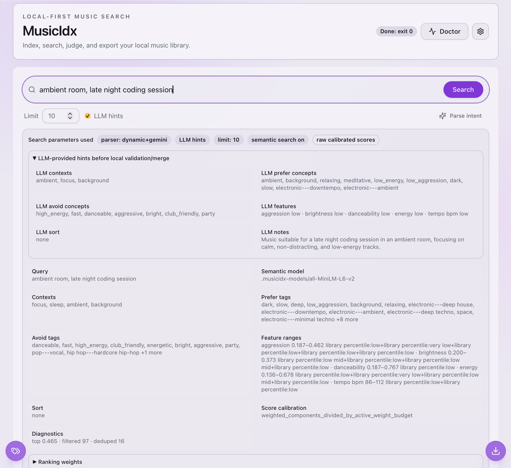
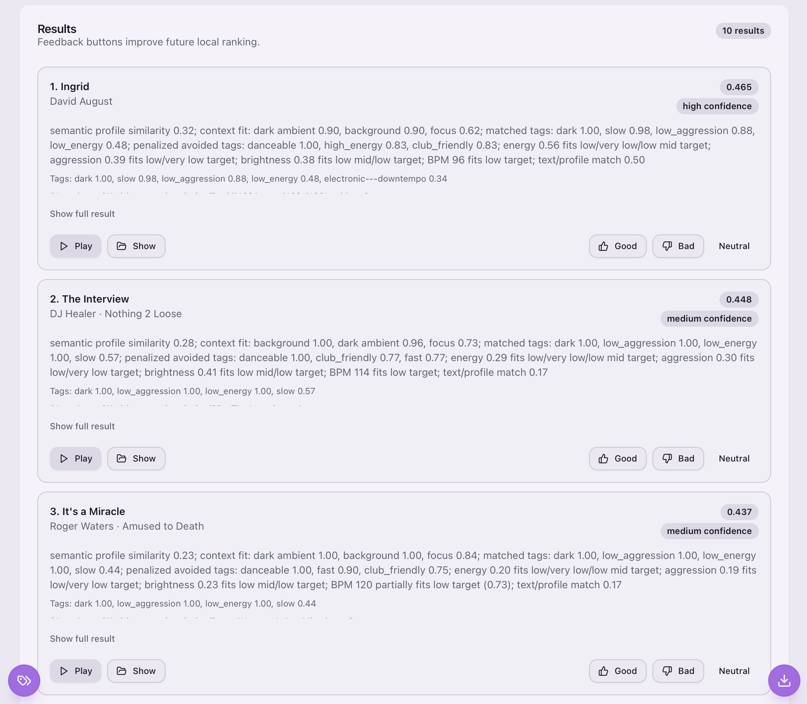

# MusicIdx

MusicIdx is a local-first music library indexer and search tool. It scans audio folders, stores metadata/features/tags/embeddings in SQLite, and supports metadata, semantic, and natural-language search with in-app playback and feedback. A Tauri desktop UI is included for local development.

## Screenshots

Search parameters, LLM hints, local validation, and raw calibrated scoring are visible for debugging:



Search results include explanations, confidence labels, playback, reveal actions, and feedback buttons:



## Status

Implemented:

- SQLite database and migrations
- recursive audio scanner
- metadata extraction with `ffprobe`, filename fallback, duplicate-based metadata repair, provenance claims, normalized artist/title fields, and metadata confidence
- SQLite FTS text search
- Chromaprint fingerprinting with `fpcalc`
- duplicate / moved-file candidate reporting
- basic audio analysis with `librosa`
- optional local Essentia mood/genre tags with subprocess batching for lower peak RAM
- versioned track profile JSON with separate semantic `embedding_text`
- local feature-derived tags and context-fit scores for vague/contextual search
- optional semantic profile embeddings with `sentence-transformers`
- hybrid natural-language search with calibrated raw scores, confidence labels, duplicate suppression, explanations, and no/weak-result suggestions
- optional Gemini/OpenAI intent parsing with local-only ranking and guardrails for overly broad LLM hints
- search export as M3U / JSON / CSV
- eval, judging, feedback, `index-health`, and metadata repair commands
- early cross-platform Tauri desktop UI with cancellable indexing, app-open background auto-indexing, search-parameter diagnostics, health card, and playback

Not implemented yet:

- signed/notarized packaged Windows/macOS desktop releases
- permanent background daemon indexing
- MCP server support
- Spotify/SoundCloud provider-native search and playlist saving
- optional RAG/LLM playlist curation layer

## Local-first defaults

MusicIdx stores data locally. Audio files are not uploaded.

Default paths:

```text
./musicidx.sqlite
./.musicidx-models/
```

Useful environment overrides:

```bash
MUSICIDX_DB_PATH=/path/to/musicidx.sqlite
MUSICIDX_MODELS_PATH=/path/to/.musicidx-models
MUSICIDX_FFPROBE_PATH=/path/to/ffprobe
MUSICIDX_FPCALC_PATH=/path/to/fpcalc
```

Optional `.env` values are loaded by the desktop wrapper during development:

```bash
cp .env.example .env
```

Keep `.env` local and do not commit API keys.

## Manual prerequisites

### Required for CLI indexing

Install these manually before full indexing:

- Python 3.11+
- `uv` or `pip`
- FFmpeg, specifically `ffprobe`
- Chromaprint, specifically `fpcalc`

macOS:

```bash
brew install uv ffmpeg chromaprint
which ffprobe
which fpcalc
```

Windows:

```powershell
# Install Python 3.11+, uv, FFmpeg, and Chromaprint/fpcalc manually.
# Then verify they are on PATH:
where ffprobe
where fpcalc
```

### Required for the desktop frontend

Install manually:

- Node.js + npm
- Rust + Cargo
- Tauri platform requirements

macOS:

```bash
xcode-select --install
brew install node rust
```

Windows:

- install Node.js LTS
- install Rust via `rustup`
- install Microsoft C++ Build Tools / Visual Studio Build Tools
- ensure Microsoft Edge WebView2 Runtime is installed

## Python setup

Recommended development setup with `uv`:

```bash
uv sync --extra dev
uv run musicidx doctor
uv run musicidx resources
```

Optional extras:

```bash
# Semantic search support
uv sync --extra dev --extra semantic

# Local Essentia ML tag support
uv sync --extra dev --extra ml

# Everything, if the current platform has compatible Essentia wheels
uv sync --extra dev --extra semantic --extra ml
```

If `essentia-tensorflow` wheels are unavailable for your Python/platform, use `--extra semantic` without `--extra ml`; search, embeddings, metadata repair, health checks, and the desktop UI still work.

Equivalent `pip` setup:

```bash
python -m venv .venv
source .venv/bin/activate
pip install -e '.[dev,semantic,ml]'
musicidx doctor
```

## Desktop frontend quick start

From the repo root:

```bash
cd desktop
npm install
```

Start the Tauri app using the repo-local CLI through `uv`:

```bash
MUSICIDX_DB_PATH="$PWD/musicidx.sqlite" \
MUSICIDX_MODELS_PATH="$PWD/.musicidx-models" \
MUSICIDX_CLI_PATH=uv \
MUSICIDX_CLI_PREFIX_ARGS="run --extra semantic musicidx" \
npm run tauri:dev
```

Windows PowerShell:

```powershell
$env:MUSICIDX_DB_PATH = "$PWD/musicidx.sqlite"
$env:MUSICIDX_MODELS_PATH = "$PWD/.musicidx-models"
$env:MUSICIDX_CLI_PATH = "uv"
$env:MUSICIDX_CLI_PREFIX_ARGS = "run --extra semantic musicidx"
npm run tauri:dev
```

If optional ML dependencies are not installed, use a lighter prefix:

```bash
MUSICIDX_CLI_PATH=uv MUSICIDX_CLI_PREFIX_ARGS="run musicidx" npm run tauri:dev
```

If `musicidx` is already installed on `PATH`, you can simply run:

```bash
cd desktop
npm run tauri:dev
```

In the app, open **Settings** and check:

```text
Working directory: repo/library directory
CLI path:          uv, or musicidx if installed globally
CLI prefix args:   run musicidx, or run --extra semantic musicidx
Music folder:      folder to index
DB path:           optional; defaults to ./musicidx.sqlite
Models path:       optional; defaults to ./.musicidx-models
```

When a music folder is configured, the desktop app checks for changes while it is open. The interval is configurable in Settings, defaults to 1 minute for testing, and can be changed to 5/10/30/60 minutes. Background auto-indexing has its own resource profile and defaults to Balanced, which is faster than conservative Auto/Low but less aggressive than Full. If files were added or modified, it runs the same safe adaptive indexing pipeline in the background and shows progress with a Cancel button. Removed files are marked missing immediately; if a previously indexed music folder disappears, its active tracks are marked missing instead of crashing the watcher. Modified files invalidate stale metadata, fingerprints, audio features, tags, profiles, and embeddings so they are refreshed by the pipeline.

More desktop notes: [`docs/desktop-tauri.md`](docs/desktop-tauri.md).

To build a large copy-to-another-Mac installer with the backend, dependencies, models, and audio helper binaries bundled:

```bash
npm --prefix desktop run package:mac:all-in-one
```

For an Intel Mac target, run this on an Intel macOS builder:

```bash
npm --prefix desktop run package:mac:intel:all-in-one
```

See [`docs/packaging-macos.md`](docs/packaging-macos.md).

## Supported audio files

```text
.mp3 .flac .m4a .aac .wav .aiff .aif .ogg .opus .alac .wv
```

## Low-impact indexing workflow

For laptops, prefer this safer workflow first:

```bash
uv run musicidx init
uv run musicidx scan /path/to/music
uv run musicidx metadata --missing-only
uv run musicidx repair-metadata --from-filename --from-duplicates --missing-only --json
uv run musicidx fingerprint --missing-only
uv run musicidx analyze-basic --chunked --chunk-sec auto --workers auto --resource-profile auto
uv run musicidx analyze-tags --missing-only --workers auto --resource-profile auto --subprocess-batches --batch-size auto
uv run musicidx rebuild-derived
uv run musicidx rebuild-profiles
uv run musicidx embed --model .musicidx-models/all-MiniLM-L6-v2 --batch-size auto --resource-profile auto
```

Notes:

- `--resource-profile auto` scales workers, chunk size, and batch size from detected RAM/CPU.
- Available requested profiles: `auto`, `low`, `balanced`, `full`. `auto` scales by RAM: low under 16GB, balanced around 16GB, high around 24GB, and full at 32GB+.
- `analyze-basic --chunked` analyzes the whole track in sequential chunks to reduce peak RAM for long tracks.
- `analyze-tags` is the most memory-sensitive step; subprocess batches are enabled by default so TensorFlow/Essentia memory is reclaimed between small batches.
- `rebuild-derived` turns audio features into local feature tags and context-fit scores.
- `repair-metadata` persistently fills missing title/artist from filename patterns and matching duplicate/alternate tracks.
- `rebuild-profiles` regenerates profile text/JSON/embedding text after metadata, feature, tag, or context changes.
- Avoid `embed --refresh` unless you intentionally want to recompute embeddings.

## Common CLI commands

Diagnostics:

```bash
musicidx doctor
musicidx resources
musicidx resources --json
musicidx db-info
musicidx index-health --json
musicidx --help
```

Indexing JSON commands include runtime diagnostics such as `duration_sec`, `peak_memory_mb`, and child-process peak memory where available. After repairing metadata or rebuilding derived/profile state, run `rebuild-profiles` and `embed` so semantic search uses current materialized text.

Indexing:

```bash
musicidx init
musicidx scan /path/to/music --json
musicidx metadata --missing-only --json
musicidx repair-metadata --from-filename --from-duplicates --missing-only --json
musicidx fingerprint --missing-only --json
musicidx analyze-basic --chunked --chunk-sec auto --workers auto --resource-profile auto --json
musicidx analyze-tags --missing-only --workers auto --resource-profile auto --subprocess-batches --batch-size auto --json
musicidx rebuild-derived --json
musicidx rebuild-profiles --json
musicidx embed --batch-size auto --resource-profile auto --json
```

Missing/failed tracks:

```bash
musicidx missing --json
musicidx prune-missing --track-id <track-id> --json
musicidx prune-missing --all --json
musicidx failed
musicidx failed --json
musicidx retry-failed --track-id <track-id>
musicidx retry-failed --all
```

Missing tracks are files that were indexed before but are no longer present. `prune-missing` deletes database rows only; it never deletes music files. Failed/corrupt tracks are quarantined after repeated failures and skipped by default in indexing commands. If you replace/fix a file, run `retry-failed` or rescan after the file metadata changes.

Search:

```bash
musicidx search-text "Nick Drake"
musicidx search-semantic "chill atmospheric background music"
musicidx parse "chill bar"
musicidx search "chill bar" --limit 10 --explain
musicidx search "chill bar" --format json --concise
```

Export:

```bash
musicidx export "chill bar" --format m3u --out chill-bar.m3u
musicidx export "warm ambient" --format json --out results.json
musicidx export "party" --format csv --out party.csv
```

Feedback/eval:

```bash
musicidx eval eval/search_queries.json --json
musicidx judge "chill bar" --limit 10
musicidx feedback --track-id <track-id> --query "chill bar" --rating good --json
```

Models:

```bash
musicidx models path
musicidx models list
musicidx models list --json
```

For full command options, use:

```bash
musicidx COMMAND --help
```

## Optional LLM intent parsing

LLM support is disabled by default. Ranking still happens locally against the SQLite database.

Gemini is the default provider when `--llm` is used:

```bash
export GEMINI_API_KEY=...
export MUSICIDX_GEMINI_MODEL=gemini-2.0-flash
musicidx search "late night reflective electronic" --llm
```

OpenAI can be selected explicitly:

```bash
export OPENAI_API_KEY=...
musicidx search "warm acoustic morning" --llm --llm-provider openai
```

When `--llm` is used, MusicIdx sends the query and an aggregate library profile to the selected provider for intent parsing. It does not send audio files or full track lists. LLM hints are validated before they affect ranking; suspiciously broad outputs are ignored and the local dynamic parser is used instead.

## Future MCP and streaming integrations

Planned MCP support should start with safe, read-only local MusicIdx tools for search, index health, and track details. Local paths should stay hidden by default, and MCP should be optional.

A later streaming integration should search provider catalogs directly, not only export local results:

```text
natural-language query
→ MusicIdx-style intent parsing/query expansion
→ Spotify/SoundCloud provider API search
→ local reranking with score/confidence/explanations
→ playlist preview
→ explicit confirmed save to Spotify/SoundCloud playlist
```

Local-to-provider matching can be added as an optional path for exporting local MusicIdx search results, but provider-native search should be the primary Spotify/SoundCloud workflow.

RAG is not required for core search/export. If added later, it should be an optional curation layer after deterministic retrieval/ranking, for tasks such as query expansion, playlist refinement, ordering, and friendly explanations. It must use redacted result metadata only; do not send local paths, DB paths, API keys, tokens, raw audio, or secrets to an LLM.

Streaming credentials must come from environment variables, local config, or keychain/token storage. Do not pass API keys or OAuth tokens through MCP tool arguments. Playlist writes should require an explicit server flag and `confirm=true`, with private playlists as the safe default where supported.

Implementation planning notes:

- [MCP server plan](.agents/musicidx_mcp_server_plan_for_pi.md)
- [MCP streaming integrations plan](.agents/musicidx_mcp_streaming_integrations_plan_for_pi.md)
- [Installation/models plan](.agents/musicidx_installation_and_models_plan_for_pi.md)

## JSON contracts

The desktop UI uses concise JSON CLI output. See:

- [`docs/ui-json-contracts.md`](docs/ui-json-contracts.md)
- [`docs/desktop-tauri.md`](docs/desktop-tauri.md)

## Development checks

```bash
uv run --no-project --with ruff ruff check .
PYTHONPATH=src uv run --no-project --with pytest --with numpy python -m pytest -q
npm --prefix desktop run build
cargo check --manifest-path desktop/src-tauri/Cargo.toml
```

## Privacy notes

- Default operation is local-only.
- SQLite DB, embeddings, fingerprints, and feedback are stored locally.
- Audio files are not uploaded.
- Cloud LLM calls happen only when `--llm` is explicitly enabled.

## License

MIT. See [`LICENSE`](LICENSE).
